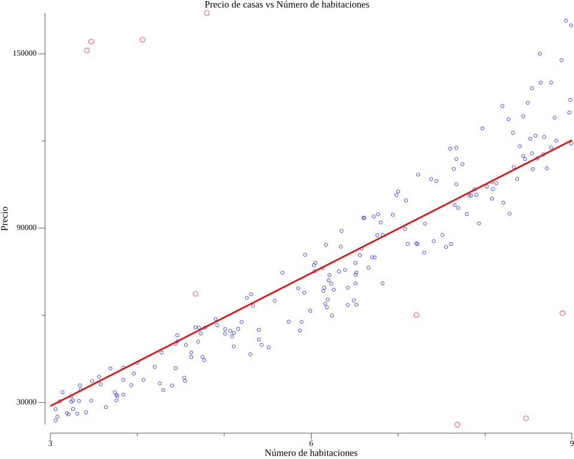

# Learning Neural Networks With Go (Golang) 

## Ejercicios Python traducidos a Go curso de Redes Neuronales

[IA NOTEBOOK DotCSV](https://www.youtube.com/watch?v=w2RJ1D6kz-o&list=PL-Ogd76BhmcCO4VeOlIH93BMT5A_kKAXp&ab_channel=DotCSV)

## Notebook 1

regresión lineal

